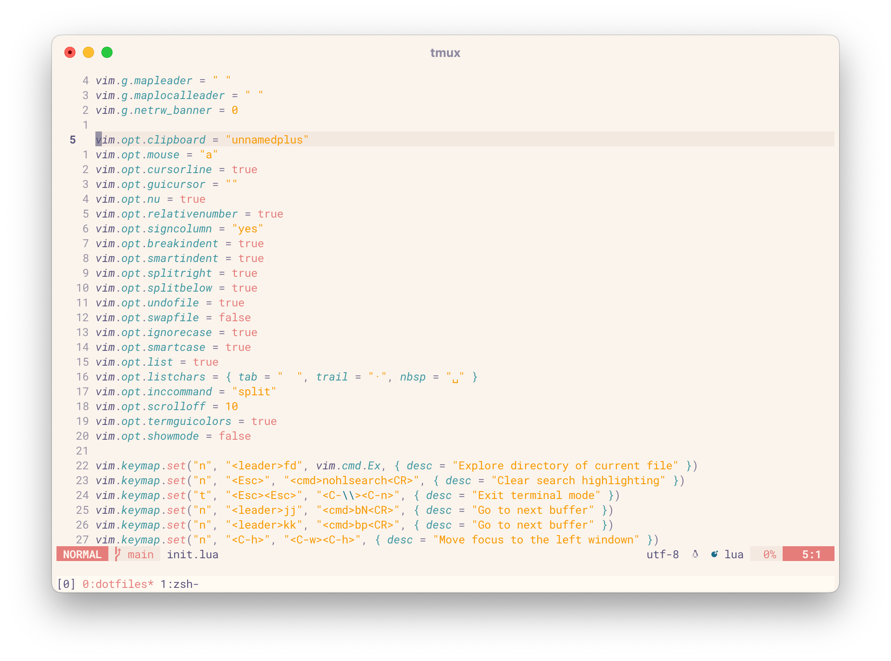
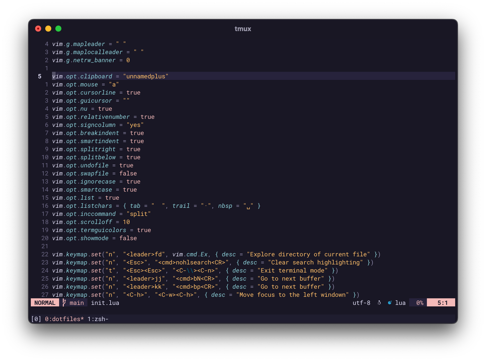

# dotfiles

My configuration files.

Some configurations use macOS-specific command line tools. If you try to run them elsewhere, they will fail, but it might be easy to adapt them to any *nix OS.

Here you can find configurations for:

- git
- homebrew
- iterm2
- neovim
- tmux
- zsh

For colors, I think [Rosé Pine](https://rosepinetheme.com) has a very pleasant color palette.

The font I use is **RobotoMono Nerd Font** and it can be downloaded from [nerdfonts.com](https://www.nerdfonts.com).

Here's how the terminal and things underneath it look depending on the selection between light and dark options in the appearance settings of macOS.

